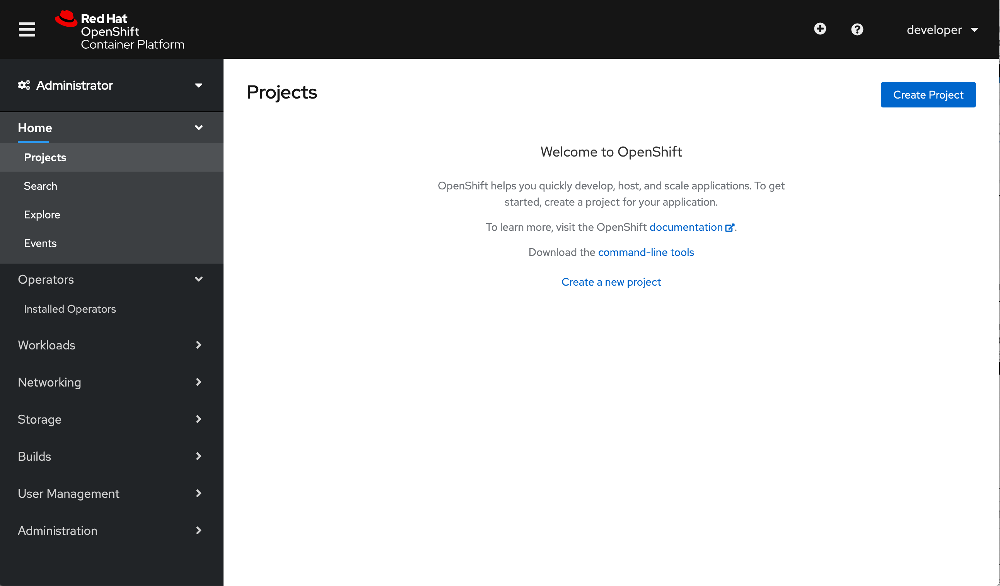
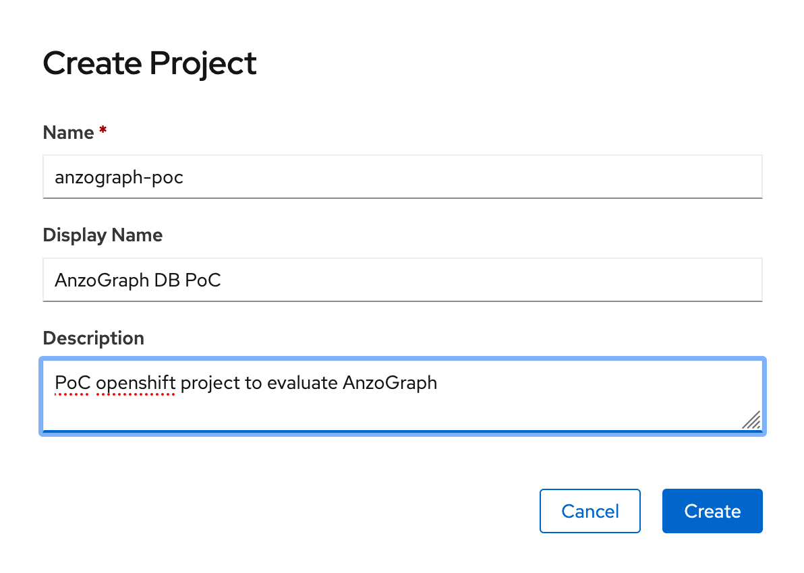
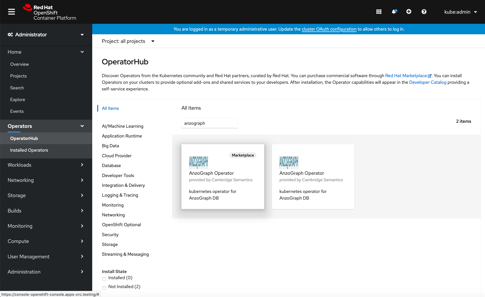
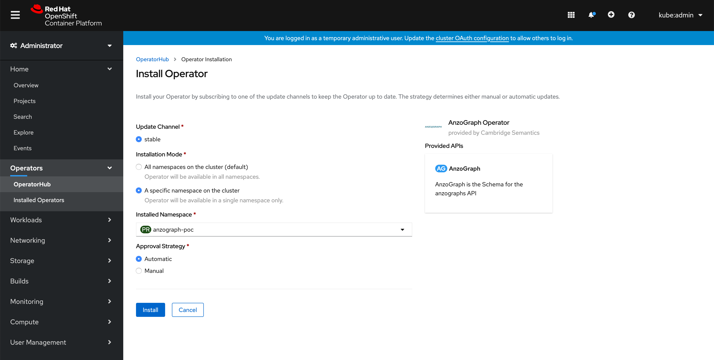
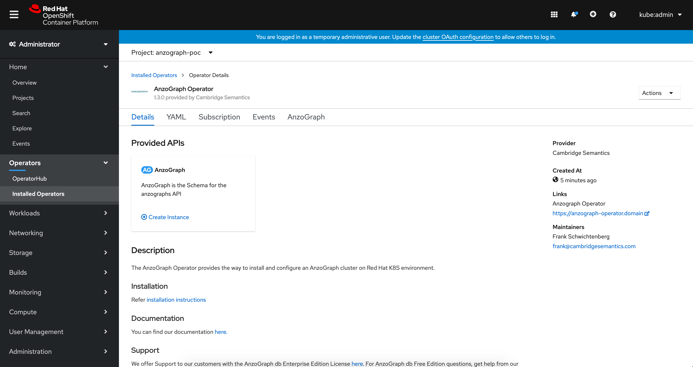
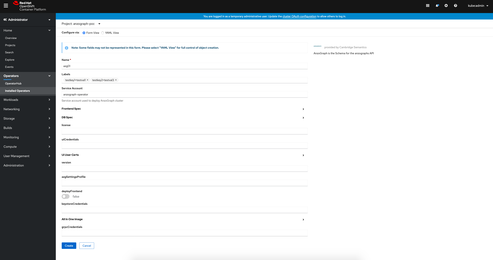
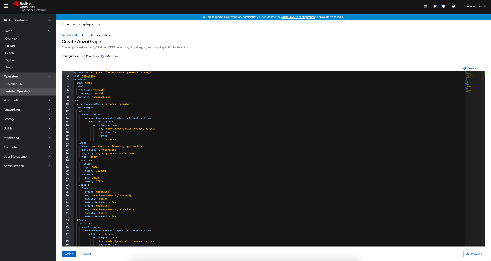

# anzograph-operator

## By Cambridge Semantics Inc.

## Prerequisites

* Red Hat Openshift Container Platform on Kubernetes, version >= 4.3
* Kubectl, versions {1.24-1.16}
* Anzograph Operator Subscription

## Optional Prerequisites
### Create Project(Namespace) if required



## Steps to deploy AnzoGraph Operator

#### Login to OpenShift Console:

#### Operators --> OperatorHub --> Search Anzograph  Operator --> Install


#### Select Namespace where you want to deploy the operator and click on Install


#### Check Operator Installation Successful


## AnzoGraph Use Cases
* AnzoGraph DB images default has single node 8GB license. Ex:- CR Spec to deploy 1 Database (8vCPU 8GB Memory) X 1 Frontend(2vCPU 4GB Memory)
```
apiVersion: anzograph.clusters.cambridgesemantics.com/v2
kind: AnzoGraph
metadata:
  name: azg01
spec:
  db:
    nodeConfig:
      spec:
        replicas: 1
        selector:
          matchLabels:
            app_data: anzograph-data-grpc
            app_mgmt: anzograph-mgmt-grpc
        serviceName: anzograph-azg01
        template:
          metadata:
            labels:
              app_data: anzograph-data-grpc
              app_mgmt: anzograph-mgmt-grpc
          spec:
            containers:
            - image: registry.connect.redhat.com/rhm/cambridgesemantics/anzograph-db:latest
              name: db
              resources:
                limits:
                  cpu: 8000m
                  memory: 8Gi
                requests:
                  cpu: 8000m
                  memory: 8Gi
            serviceAccountName: anzograph-operator
  deployFrontend: true
  frontend:
    nodeConfig:
      spec:
        replicas: 1
        selector:
          matchLabels:
            app_mgmt: anzograph-frontend
        serviceName: anzograph-azg01
        template:
          metadata:
            labels:
              app_mgmt: anzograph-frontend
          spec:
            containers:
            - image: registry.connect.redhat.com/rhm/cambridgesemantics/anzograph-frontend:latest
              name: frontend
              resources:
                limits:
                  cpu: 2000m
                  memory: 4Gi
                requests:
                  cpu: 2000m
                  memory: 4Gi
            serviceAccountName: anzograph-operator
```
**Note**
* Registering AnzoGraph product will provide 1 Node 16GB license. Follow this doc [License](https://docs.cambridgesemantics.com/anzograph/userdoc/register-license.htm) Ex:- CR Spec to deploy 1 Database (8vCPU 16GB Memory) X 1 Frontend(2vCPU 4GB Memory)
```
apiVersion: anzograph.clusters.cambridgesemantics.com/v2
kind: AnzoGraph
metadata:
  name: azg01
spec:
  db:
    nodeConfig:
      spec:
        replicas: 1
        selector:
          matchLabels:
            app_data: anzograph-data-grpc
            app_mgmt: anzograph-mgmt-grpc
        serviceName: anzograph-azg01
        template:
          metadata:
            labels:
              app_data: anzograph-data-grpc
              app_mgmt: anzograph-mgmt-grpc
          spec:
            containers:
            - image: registry.connect.redhat.com/rhm/cambridgesemantics/anzograph-db:latest
              name: db
              resources:
                limits:
                  cpu: 8000m
                  memory: 16Gi
                requests:
                  cpu: 8000m
                  memory: 16Gi
            serviceAccountName: anzograph-operator
  deployFrontend: true
  frontend:
    nodeConfig:
      spec:
        replicas: 1
        selector:
          matchLabels:
            app_mgmt: anzograph-frontend
        serviceName: anzograph-azg01
        template:
          metadata:
            labels:
              app_mgmt: anzograph-frontend
          spec:
            containers:
            - image: registry.connect.redhat.com/rhm/cambridgesemantics/anzograph-frontend:latest
              name: frontend
              resources:
                limits:
                  cpu: 2000m
                  memory: 4Gi
                requests:
                  cpu: 2000m
                  memory: 4Gi
            serviceAccountName: anzograph-operator
```

## Steps to deploy AnzoGraph Cluster

#### Operators --> Installed Operators --> AnzoGraph  Operator --> Create Instance


#### Use either Form View or YAML View to set required properties, use **AnzoGraph CustomResource(CR) Specification** for definitiions



## AnzoGraph CustomResource(CR) Specification


The following table lists the configurable parameters for AnzoGraph and their default values.(CR API Version: v1beta1)

| Parameter | Description | Default |
|-----------|-------------|---------|
| `metadata.name` | Name of CR | |
| `metadata.namespace` | Namespace of CR | |
| `metadata.labels` | Dictionary of (key: val) as labels of CR | |
| `spec.db.nodeConfig.spec` | Configuration specification for AnzoGraph DB pods | |
| `spec.db.nodeConfig.spec.replicas` | Number of pods for AnzoGraph DB | 1 |
| `spec.db.nodeConfig.spec.serviceName` | Name of headless service for AnzoGraph | anzograph-<metadata.name> |
| `spec.db.nodeConfig.spec.template.spec.serviceAccountName` | Service account name for pods | anzograph-operator |
| `spec.db.nodeConfig.spec.template.spec.containers.x.Name` | Name of AnzoGraph DB container | db |
| `spec.db.nodeConfig.spec.template.spec.containers.y.Name` | Name of sidecar container, if sidecar logging is enabled | logger |
| `spec.db.deployLoggerSidecar` | Set this to true to enable sidecar logging | false |
| `spec.db.service` | Database loadbalancer service attributes, of type v1.Service | commented, please uncomment to add value |
| `spec.db.volumes` | List of persistent volumes for AnzoGraph DB | commented, please uncomment to add value |
| `spec.db.volumes.[i].name` | Name for persistent volume | |
| `spec.db.volumes.[i].mountPath` | Path where persistent volume should be mounted inside container | |
| `spec.db.volumes.[i].pv` | Attributes to configure persistent volume, of type v1.PersistentVolume | |
| `spec.db.volumes.[i].pvc` | Attributes to configure persistent volume claim, of type v1.PersistentVolumeClaim | |
| `spec.db.volumes.[i].deletePVC` | Set this to true if you want to delete PVC after CR deletion | false |
| `spec.db.settingsProfile` | Named settings bundles/profiles to configure AnzoGraph | standalone |
| `spec.db.settingsConfContent` | When settingsProfile is 'custom', use this to override default settings(dictionary of key: val) | |
| `spec.db.license` | User provided license string(BYOL) | "" |
| `spec.frontend.nodeConfig.spec` | Configuration specification for AnzoGraph Frontend pods | |
| `spec.frontend.nodeConfig.spec.replicas` | Number of pods for AnzoGraph Frontend | 1 |
| `spec.frontend.nodeConfig.spec.serviceName` | Name of headless service for AnzoGraph | anzograph-<metadata.name> |
| `spec.frontend.nodeConfig.spec.template.spec.serviceAccountName` | Service account name for pods | anzograph-operator |
| `spec.frontend.nodeConfig.spec.template.spec.containers.x.Name` | Name of AnzoGraph Frontend container | frontend |
| `spec.frontend.service` | Database loadbalancer service attributes, of type v1.Service | commented, please uncomment to add value |
| `spec.frontend.volumes` | List of persistent volumes for AnzoGraph DB | commented, please uncomment to add value |
| `spec.frontend.volumes.[i].name` | Name for persistent volume | |
| `spec.frontend.volumes.[i].mountPath` | Path where persistent volume should be mounted inside container | |
| `spec.frontend.volumes.[i].pv` | Attributes to configure persistent volume, of type v1.PersistentVolume | |
| `spec.frontend.volumes.[i].pvc` | Attributes to configure persistent volume claim, of type v1.PersistentVolumeClaim | |
| `spec.frontend.volumes.[i].deletePVC` | Set this to true if you want to delete PVC after CR deletion | false |
| `spec.uiCredentials.uiCredentials` | Name of existing secret for frontend credentials | |
| `spec.uiCredentials.grpcCredentials` | Name of existing secret for gRPC credentials | |
| `spec.uiCredentials.keystoreCredentials` | Name of existing secret for frontend keystore | |
| `spec.deployFrontend` | Set this to true if you want to deploy frontend for AnzoGraph DB | false |
| `spec.uiUserCerts.uiUserServiceCert` | AnzoGraph UI access certificate | commented, please uncomment to add value |
| `spec.uiUserCerts.uiUserServiceKey` | AnzoGraph UI access certificate key | commented, please uncomment to add value |
| `spec.uiUserCerts.uiUserCACert` | AnzoGraph UI access ca certificate | commented, please uncomment to add value |

## References

```https://docs.cambridgesemantics.com/```
